1. Verifying that Sysmon events are archived


Verified that the original Sysmon Process Create event containing net1.exe was successfully stored in archives.json. This confirmed that the Windows agent, Sysmon and log collection pipeline were functioning correctly before troubleshooting the detection rule.

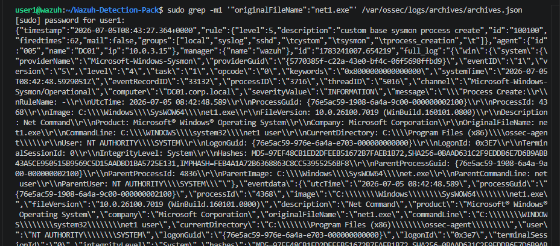

2. Confirming that the built-in parent rule is triggered


Searched for built-in rule 92031 in the Wazuh dashboard. The rule fired successfully, proving that the event reached the analysis engine and that the parent rule was evaluated correctly.

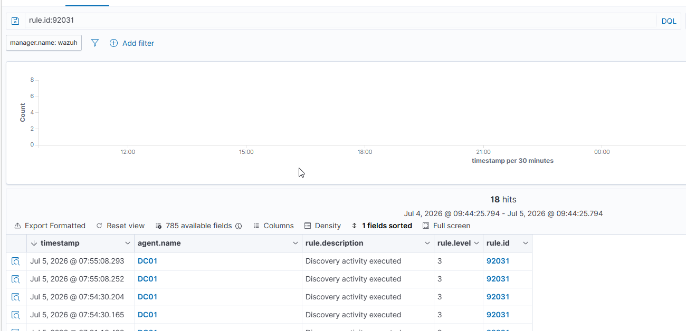

3. Reviewing the built-in detection chain


Inspected the default Wazuh Sysmon rules responsible for net.exe detection. The built-in rule 92039 should inherit from 92031 and match win.eventdata.commandLine, making it a suitable reference for the custom rule implementation.

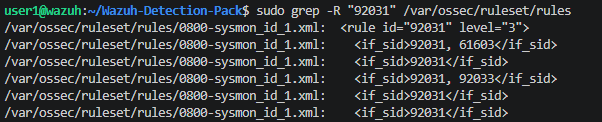

full output of ```bash
sudo sed -n '340,445p' /var/ossec/ruleset/rules/0800-sysmon_id_1.xml``` in screenshots called 3.5.txt

4. Verifying rule directories


Confirmed that both default and custom rule directories were correctly configured in ossec.conf, ensuring that user-defined XML rule files were loaded together with the official Wazuh rules.

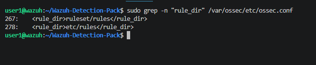

5. Validating rule syntax


Executed the Wazuh rule parser to verify XML syntax. The configuration completed without errors, confirming that the custom rule file was syntactically valid.

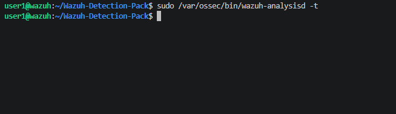

6. Confirming that the custom rule is loaded


Inspected analysisd.log and confirmed that 100101_net_user.xml was successfully discovered and loaded by the Wazuh analysis engine during startup.

```bash
user1@wazuh:~/Wazuh-Detection-Pack$ grep "100101_net_user.xml" analysisd.log

2026/07/05 16:13:36 wazuh-analysisd[82928] rules-config.c:371 at Read_Rules(): DEBUG: Adding rule: etc/rules/100101_net_user.xml
2026/07/05 16:13:37 wazuh-analysisd[82928] rules.c:246 at Rules_OP_ReadRules(): DEBUG: etc/rules/100101_net_user.xml is the rulefile
```

7. Verifying rule deployment


Checked the contents of /var/ossec/etc/rules to ensure the custom rule file was present in the active configuration directory.

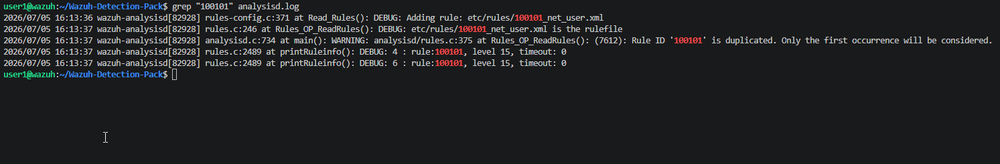

8. Reviewing the custom rule


Verified the custom XML rule configuration using if_sid="92031" together with the commandLine field match for the keyword user.

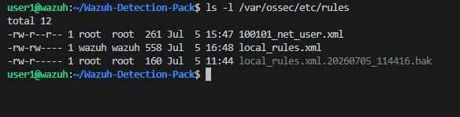

9. Testing custom rule execution


Searched for alerts generated by rule 100101. Only earlier test alerts without field matching were present. No new alerts were generated after introducing the <field> condition.

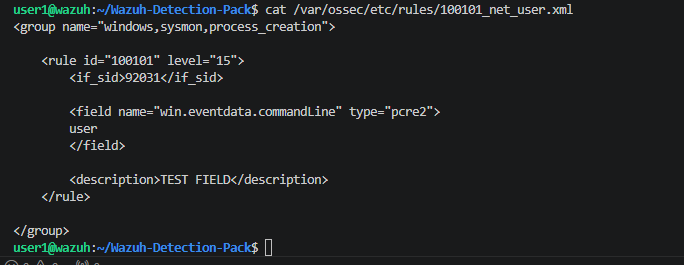

10. Isolating the problem


Removed all field matching conditions, leaving only the inherited rule (if_sid=92031). The simplified rule immediately started generating alerts, proving that rule inheritance worked correctly while field 
evaluation appeared to be failing.

```xml
<rule id="100101" level="15">

    <description>TEST 2</description>

</rule>
```
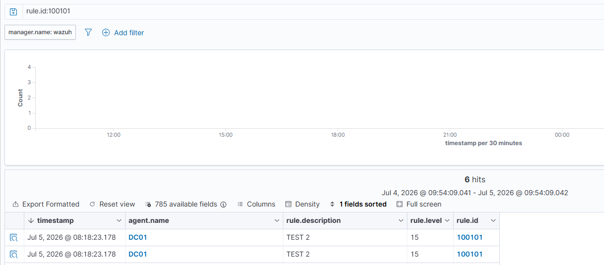

11. Verifying rule behavior after adding field matching


Reintroduced the win.eventdata.commandLine field. Despite valid event data, the rule stopped firing completely, indicating that the issue was specifically related to field evaluation rather than rule loading.

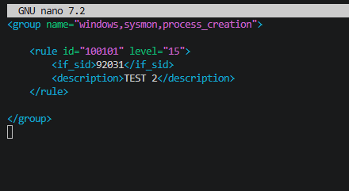

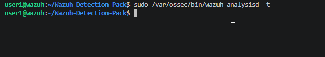

parser working

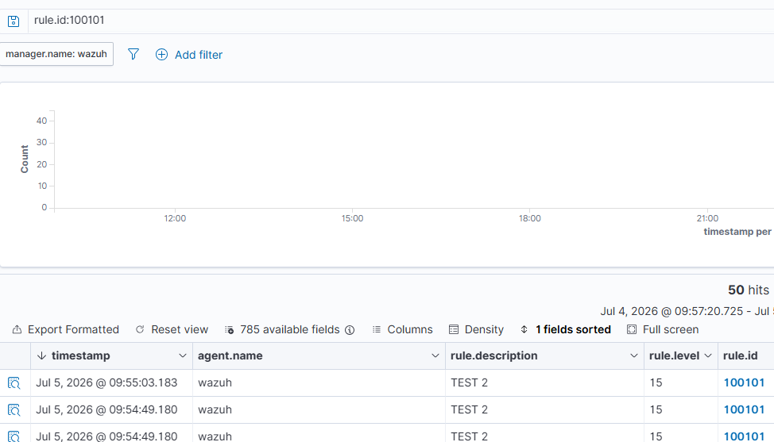

still no more alerts

12. Reproducing the behavior


Repeated the experiment several times with different field configurations. Every attempt produced the same result: removing <field> restored detection, while adding any field prevented the rule from triggering.

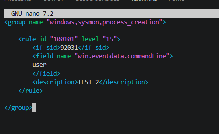

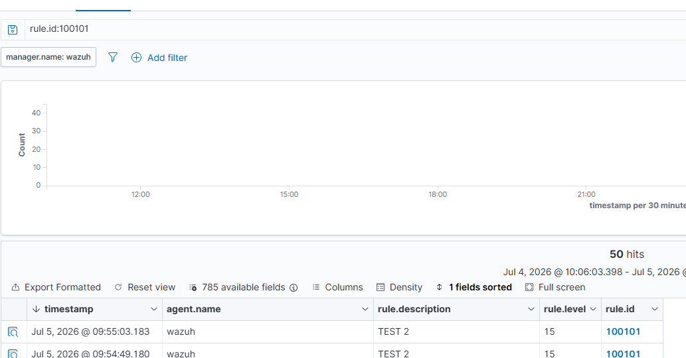

same result

13. Trying with different regex


the same result

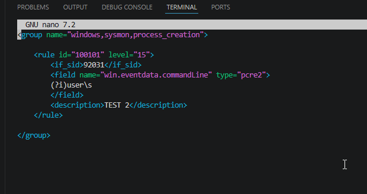

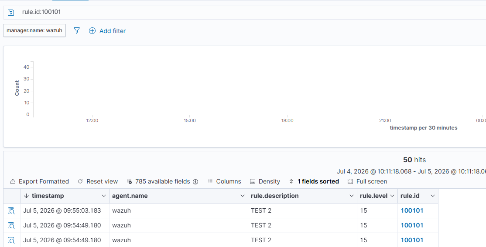

14. Validating field extraction with wazuh-logtest


Validated the original Sysmon JSON event using wazuh-logtest. The decoder successfully parsed the event and extracted all expected fields, including win.eventdata.commandLine, win.eventdata.originalFileName, and other Sysmon metadata. This confirmed that JSON decoding was functioning correctly and that the required fields were available for rule evaluation.

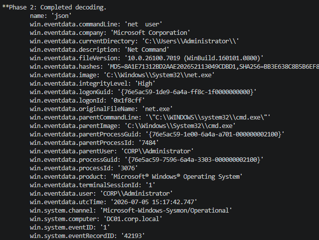

 full logtest here: screenshots/netuser/14 wazuch-logtest.txt
 json added to logtest here: screenshots/netuser/14net-user.json.txt


15. Verifying built-in rule execution


Checked whether the built-in rule 92039 generated alerts for the same event. No matching alerts were found in alerts.json, despite the parent rule (92031) firing correctly and the required event fields being present.

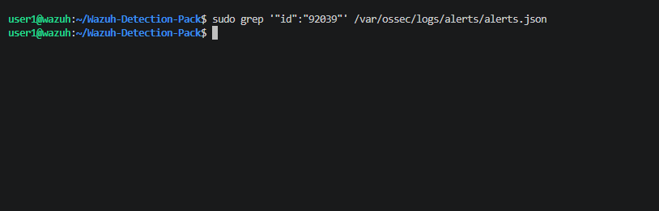

17. Verifying Wazuh installation


Verified the installed Wazuh components and confirmed that both the manager and analysis engine were running version 4.14.5, eliminating a version mismatch as the source of the issue.

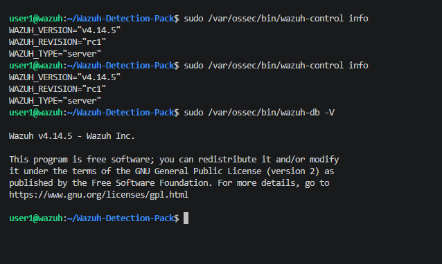

18. Investigating decoder availability


Searched for decoder definitions related to windows_eventchannel and JSON parsing. No custom decoder overrides were found, indicating that the system relied entirely on the default Wazuh decoders.

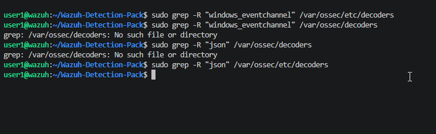

19. Inspecting analysis engine debug output


Searched the analysisd debug log for references to commandLine and originalFileName. No field evaluation traces were produced, making it impossible to determine why <field> conditions were ignored during rule matching.

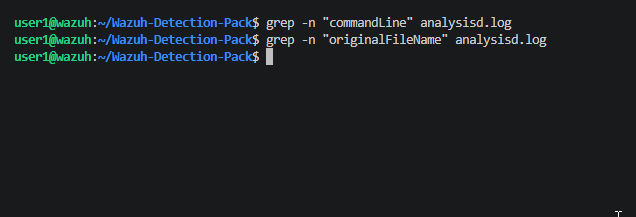

Final observation


After multiple validation steps, the investigation consistently demonstrated that:

- Sysmon events were collected successfully.
- JSON decoding worked correctly.
- Built-in parent rule 92031 fired as expected.
- Custom rules were loaded successfully.
- Rule inheritance (if_sid) functioned correctly.
- Introducing any <field> condition prevented the rule from matching, despite the corresponding fields being present in the decoded event.

This behavior could not be reproduced by syntax validation and appears to indicate an unexpected issue with field evaluation rather than an XML configuration error.

## 20. Escalating the investigation to the Wazuh maintainers

After exhausting all local troubleshooting steps, the findings were documented and submitted as a GitHub issue to the official Wazuh repository here:

https://github.com/wazuh/wazuh/issues/37589


The report included:

- the custom detection rule,
- Sysmon event samples,
- `wazuh-logtest` output,
- analysis engine logs,
- validation results,
- screenshots demonstrating the issue.

The initial assumption was that the problem was related to rule field evaluation.

---

## 21. Discovering an unexpected agent installation issue

While working with the Wazuh maintainers, the investigation shifted away from the detection rule itself.

Additional diagnostics on the Windows agent revealed that the installation directory was incomplete.

The following components were missing:

- `queue\`
- `queue\logcollector\file_status.json`
- `queue\syscollector\db\local.db`

The agent logs also reported SQLite initialization errors, suggesting that the installation itself was unhealthy.


```cmd
tree "C:\Program Files (x86)\ossec-agent"

dir "C:\Program Files (x86)\ossec-agent"
```

---

## 22. Verifying a clean installation

Following the maintainer's recommendation, a completely fresh Windows virtual machine was prepared.

Performed steps:

- uninstalling the previous agent,
- manually removing the installation directory,
- installing Wazuh Agent 4.14.6,
- configuring the manager connection.

This time, the installation created the complete directory structure, including all expected `queue` components.

The agent successfully connected to the manager.

Verification:

```cmd
Get-Service WazuhSvc

tree "C:\Program Files (x86)\ossec-agent"
```

---

## 23. Confirming Sysmon event ingestion

After the clean installation, Sysmon Process Create events were successfully forwarded to the Wazuh manager.

Verification on the manager:

```bash
sudo grep "Microsoft-Windows-Sysmon" /var/ossec/logs/archives/archives.json
```

The original communication problem between the Windows agent and the manager was no longer present.

---

## 24. Validating the official upgrade path

To determine whether the issue was related to a faulty installer, the official upgrade scenario suggested by the maintainer was reproduced.

Steps:

- clean installation of Wazuh Agent 4.14.5,
- verification of correct operation,
- upgrade to Wazuh Agent 4.14.6.

Both versions created the expected installation structure, and the upgrade completed successfully without removing the `queue` directory.

Version verification:

```cmd
type "C:\Program Files (x86)\ossec-agent\VERSION.json"
```

---

## 25. Final outcome

The original installation problem could not be reproduced.

The following scenarios were successfully validated:

- clean installation of Wazuh Agent 4.14.5,
- clean installation of Wazuh Agent 4.14.6,
- upgrade from 4.14.5 to 4.14.6.

After reviewing the collected evidence, the Wazuh maintainer concluded that the original installation failure was most likely caused by environment-specific corruption rather than a reproducible installer defect.

The GitHub issue was closed with the recommendation to enable verbose MSI logging if the problem ever reappears.


```cmd
msiexec /i wazuh-agent-4.14.6-1.msi /l*v installer.log
```

---


